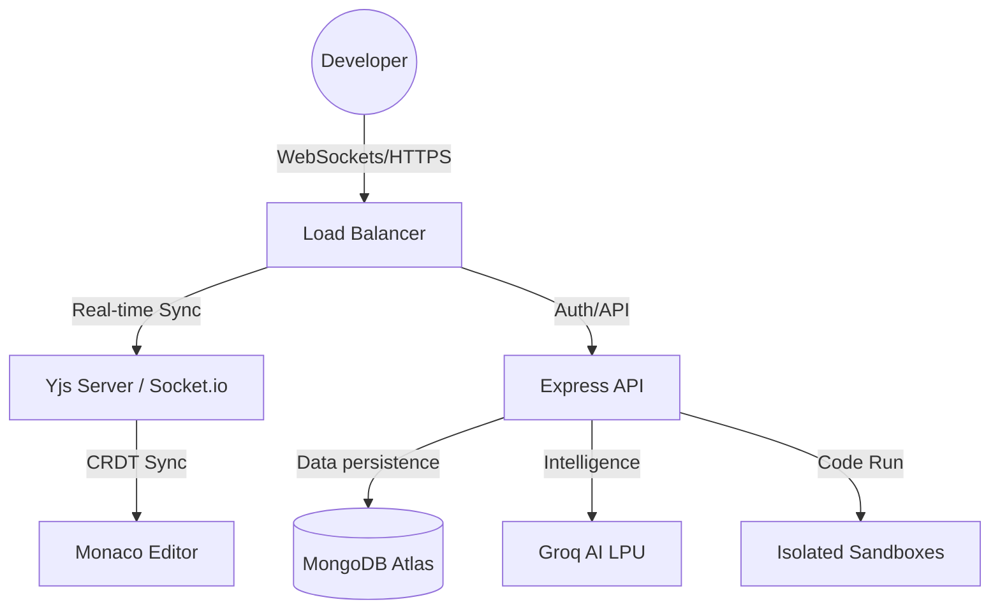

# Emerge - Developer's Den 🚀

> **The Kinetic Forge for Collaborative Engineering.**  
> A high-performance, cloud-based IDE designed for 100+ simultaneous users with real-time editing, AI-powered orchestration, and deep developer identity.


---

## 🌌 The Creative North Star: The Kinetic Terminal

**Emerge** isn't just an IDE; it's a high-performance instrument. Moving away from traditional "boxy" interfaces, we embrace **The Kinetic Terminal**—a design system bridging raw CLI utility with modern editorial elegance.

- **Intentional Asymmetry**: Breaking the template with exaggerated whitespace and tonal depth.
- **Surface Hierarchy**: Sectioning defined by tonal shifts (#0a0e14 to #1b2028) rather than lines.
- **Glassmorphism**: 80% opacity panels with `20px` backdrop-blur for a "physical workspace" feeling.

---

## 🧠 The AI Architect (Context-Aware Engine)

Unlike standard AI assistants, **Emerge** features a multi-layered Intelligence Engine that understands the **soul of your project**.

### 🌑 Project Shadow (Session Memory)
The AI maintains a "Shadow" of your recent activity, tracking the last **5 unique files** you've visited. It can answer cross-file questions without you manually pasting code.

### 🔦 Hyper-Focus (Sliding Window)
Instead of overwhelming the LLM, we feed it a high-definition "Sliding Window" (±50 lines around your cursor). This ensures precision suggestions that match your current cognitive focus.

### 🕵️ Forensic `/debug` Command
Typing `/debug` in the console triggers a forensic analysis of terminal logs, performing root-cause analysis on compilation or runtime errors instantly.

---

## 🛠️ Tech Stack & Surface Architecture

### Frontend (The Interface)
- **Framework**: React.js 19 (Vite)
- **Editor**: Monaco Editor (VS Code Engine)
- **Styling**: Tailwind CSS 4.0
- **State**: Zustand (Atomic state management)
- **Auth**: Clerk (Social OAuth) + JWT

### Backend (The Core)
- **Runtime**: Node.js + Express
- **Real-Time**: Socket.io + Yjs (CRDT for conflict-free editing)
- **AI**: Groq LPU (Llama 3.1-8b-instant)
- **Database**: MongoDB Atlas

### Infrastructure
- **Execution**: Dockerized Sandboxes (Node.js/Python/C++)
- **Orchestration**: Custom Event Bus for multiplayer sync

---

## 🏗️ System Architecture



---

## 🚀 Quick Start Guide

### 1. Prerequisites
- Node.js (v18+)
- MongoDB Atlas URI
- Groq API Key
- Clerk Publishable Key

### 2. Installation

**Backend Setup:**
```bash
cd backend
npm install
# Create .env with MONGODB_URI, JWT_SECRET, GROQ_API_KEY
npm run dev
```

**Frontend Setup:**
```bash
cd frontend
npm install
# Create .env with VITE_API_URL, VITE_CLERK_PUBLISHABLE_KEY
npm run dev
```

---

## 🧬 Git Workflow & GitHub Management

We follow a strict **Feature-Branch** workflow to ensure main stability.

- **Naming**: `feat/` (features), `fix/` (bugs), `docs/` (documentation).
- **Commits**: Conventional Commits (e.g., `feat(ui): add kinetic glassmorphism to sidebar`).
- **Review**: All PRs require at least one approval and a successful smoke test.

See [GITHUB.md](./GITHUB.md) for detailed contribution guidelines.

---

## 👥 Contributors

Built with ❤️ for the Emerge Hackathon 2026.

---
© 2026 Developer's Den Team. All Rights Reserved.
